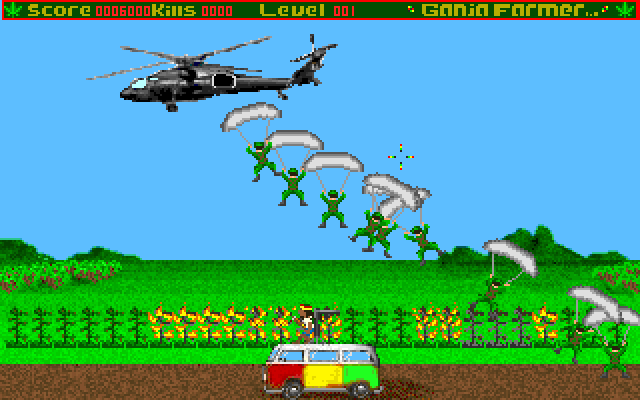

# Ganja Farmer (browser port)

A JavaScript port of **Ganja Farmer**, a 1998 DOS shooter by Jason Pitt, EvilX Systems and Xtreme Games LLC.
It runs in any modern browser, without an emulator such as DOSBox.

You are John Parker, Rasta Soldier, with a 20 mm AA gun on top of a 1969 VW microbus. Protect your herb
from The MAN.



## Play

```sh
npm install
npm start          # http-server on 0.0.0.0:8642
```

Open <http://localhost:8642/>. This serves the source modules directly, which is handy for development. The server listens on all interfaces, so other machines on your network
can play too.

| Control | Action |
|---|---|
| Mouse | aim the gun / pick menu items |
| Left click | fire |
| Right click | switch weapons |
| Space | continue / high-score table (in the menu) |
| P | pause (Enter or Space continues) |
| Esc | quit prompt (Y / N) |

Sound starts after the first click or key press, because browsers block autoplay. High scores are
kept in the browser's `localStorage`.

## How it was made

The port was done in two stages; the git history keeps both.

1. **Faithful port.** Every function of `GANJAFRM.EXE` that the game uses was translated to JavaScript
   one by one, straight from the disassembly. Each function was checked by an independent reviewer
   against the original and by differential testing: the original x86 code and the JS function run
   side by side on the same memory, and every write, call and return value must match. The hardware
   and system software it ran on were emulated around it: VGA, timer, keyboard, mouse, the PMODE/W DOS
   extender, the Watcom C runtime and the DiamondWare Sound ToolKit. That port was bug-for-bug exact,
   original bugs included. Rules: [docs/PORTING.md](docs/PORTING.md).
2. **Browser port** (current). With the exact port as the reference, the layers that only existed
   because of DOS are being replaced with plain browser code. The pictures are PNG, the sounds WAV (packed in one archive),
   the music OGG, and drawing uses WebGL. The game sleeps instead of busy-waiting. The sound driver,
   keyboard, mouse, video and files are called directly, and the DOS extender, DOS and the C start-up
   are gone. Each change is checked to leave the game's behaviour
   unchanged: see [docs/STAGE2.md](docs/STAGE2.md).

The game logic is still the translated original: the same memory layout, the same arithmetic, the
same timing (18.2 Hz BIOS ticks, 72.8 Hz sound-driver ticks).

## Build for deployment

```sh
npm run build      # dist/: index.html, one minified boot.js (+ source map), favicon, assets/
npm run preview    # serves dist/ on 0.0.0.0:8643
```

`dist/` is a static site: copy it to any web server. The bundle (esbuild) is about 160 KB, 48 KB gzipped,
instead of ~130 separate module requests.

## Tests

```sh
npm test           # unit tests + function-registry check
npm run headless   # plays a scripted tour in Node with a virtual clock, screenshots to out/headless
node tests/run-headless.mjs --trace trace.txt   # fingerprint of the whole run (see docs/STAGE2.md)
```

## Layout

```
index.html            the page
src/boot.js           browser start-up: load files, attach display/input/audio, run the program
src/machine.js        the emulated PC's power-on and program start (shared with the headless runner)
src/game/             the game's code, one file per original function (address_name.js)
src/lib/              library code: LaMothe graphics/input library, sound client, Watcom C runtime
src/runtime/          flat memory with the original addresses, function registry, x87 helpers
src/platform/         what the game runs on: display, timer, keyboard, mouse, files, sound
assets/game/          the game's data files (PNG pictures, SOUNDS.TGZ effects, OGG music, SCORES.DAT)
assets/boot/          initial data-segment image, 8x8 ROM font, file manifest
tests/                unit tests and the headless runner
scripts/build.mjs     the production build (esbuild)
docs/                 architecture, data and function names, stage-2 notes, stage-1 porting rules
```

More detail: [docs/ARCHITECTURE.md](docs/ARCHITECTURE.md); what every function and variable is:
[docs/FUNCTIONS.md](docs/FUNCTIONS.md), [docs/DATA.md](docs/DATA.md).

## Copyright

The game, its graphics, sounds and music are © 1998 Jason Pitt, EvilX Systems and Xtreme Games LLC. The
JavaScript port code is licensed GPL-3.0-or-later (see `package.json`).
